# Laboratorio #1
## Nombres
Geronimo Martinez Nuñez - Carlos David Barrero

# Tabla de Contenidos

- [Introducción](#introducción)
- [Marco Teórico](#marco-teórico)
- [Desarrollo del Tema](#desarrollo-del-tema)
  - [Virtualization Software](#virtualization-software)
  - [Unix-Based Server Setup](#unix-based-server-setup)
  - [Windows Server Installation and Configuration – Phase 1](#windows-server-installation-and-configuration--phase-1)
  - [Windows Server Installation and Configuration – Phase 2](#windows-server-installation-and-configuration--phase-2)
  - [Android Installation](#android-installation)
  - [Command Line Knowledge](#command-line-knowledge)
- [Usos y Aplicaciones](#usos-y-aplicaciones)
- [Conclusiones](#conclusiones)

---

# Introducción

...

# Marco Teórico

...

# Desarrollo del Tema

# Virtualization Software

* Record a video of up to 5 minutes addressing this topic. All team members submitting the report must participate. You may use a presentation, document, or animation to explain the subject.
[](https://youtu.be/QRz8DhMyaT8)


# Unix-Based Server Setup
## 1. Server Installation and Configuration
* Using VMware, create new virtual machines and install Linux Slackware
   # 1. Creación de la Máquina Virtual

   Se creó una nueva máquina virtual utilizando **VMware** con los siguientes parámetros recomendados para una instalación óptima de **Slackware Linux**:

   - **Memoria RAM:** 4 GB  
   - **Espacio en Disco:** 32 GB  
   - **Procesadores:** 2 núcleos, 2 hilos  
   - **Adaptador de red:** Bridged (Automático)

   # 2. Instalación del Sistema Operativo
   ## 2a. Instalación sin Interfaz Gráfica
   1. Al cargar el archivo ISO, seleccionamos la distribución de teclado español latinoamericano:  
      `qwerty/la-latin1.map`

      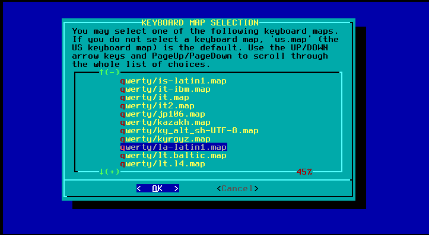

   2. Una vez cargada la consola, iniciamos sesión como **root** y ejecutamos comando `cfdisk` para crear las particiones:
      - Seleccionamos el tipo de tabla de particiones como **gpt**
      - Creamos una partición con **todo el tamaño disponible**
      - Establecemos el tipo de partición como **Linux filesystem**

      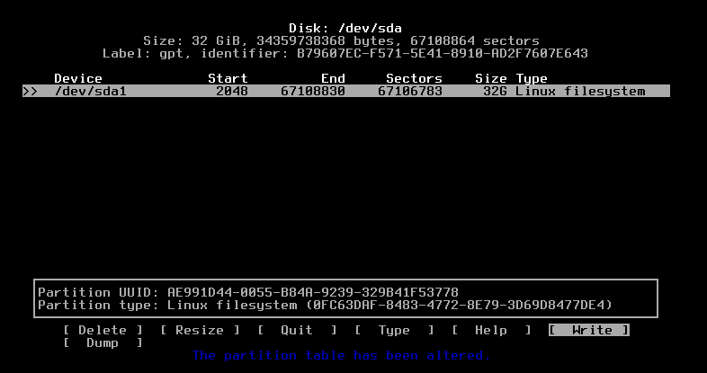

   3. Ingresamos al instalador con `setup`:

   4. En el menú del instalador:

      - Seleccionamos la opción **Add Swap**
      - Elegimos nuestra partición
      - Formateamos el disco utilizando el sistema de archivos **ext4**

      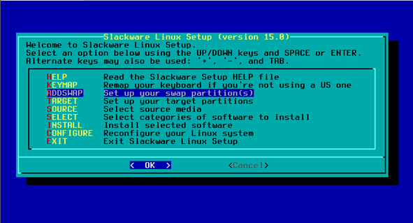  
      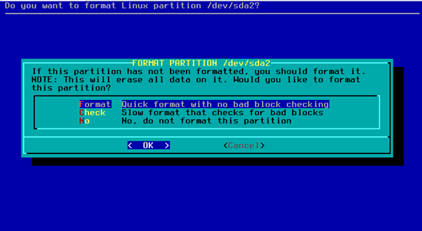  
      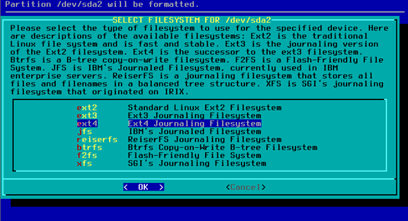

   5. Seleccionamos la instalación desde **CD/DVD** de forma automática.

   6. Elegimos los siguientes grupos de paquetes para una instalación sin entorno gráfico:

      - `A` (Base Linux System)  
      - `AP` (Applications)  
      - `L` (Libraries)  
      - `N` (Network)

      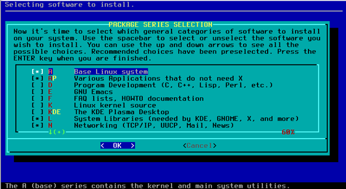

   7. Optamos por la opción **Full installation** (instalación completa).

   8. Una vez finalizada la instalación de los paquetes:
      - Omitimos la opción de crear un **USB de arranque**
      - Instalamos **LILO** de manera estándar
      - Seleccionamos como destino de LILO el **MBR**

   9. Configuración de red (según lo requerido por el laboratorio):
      - Tipo de configuración: **Static IP**
      - Dirección IP: `10.2.77.250`
      - Gateway: `10.2.65.1`
      - DNS (Nameserver): `10.2.65.1`
      - Hostname: *a elección del usuario*
      - Domain name: `is.escuelaing.edu.co`
      - Máscara de subred: `255.255.0.0` o prefijo `/16`
      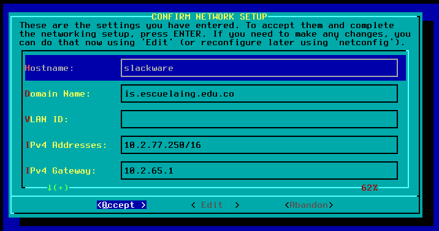

   10. Continuamos con la instalación normalmente:
      - Seleccionamos la zona horaria: `America/Bogota`
      - Asignamos una contraseña para el usuario **root**
      - Reiniciamos el sistema
   
   ## 2b. Instalación con Interfaz Gráfica
   Se siguen los mismos pasos descritos anteriormente. La única diferencia está en la selección de paquetes:

   - `A` (Base Linux System)  
   - `AP` (Applications)  
   - `KDE` (Plasma Desktop)  
   - `L` (Libraries)  
   - `N` (Network)  
   - `X` (X Window System)

   # 3. Configuración de Red

   Si por alguna razón cometiste un error al configurar los datos de red durante la instalación, puedes corregirlos editando los siguientes archivos:

   - `/etc/rc.d/rc.inet1.conf` → Configuración de IP, máscara de red, gateway, etc.
   - `/etc/resolv.conf` → Configuración de los servidores DNS.
   - `/etc/HOSTNAME` → Configuración del nombre de host.
   1. **Editar la configuración de red (IP, Gateway, etc.):**

      ```bash
      nano /etc/rc.d/rc.inet1.conf
      ```
      Busca las líneas correspondientes y corrige los valores. Por ejemplo:
      ```bash
      IPADDR[0]="10.2.77.250"
      NETMASK[0]="255.255.0.0"
      GATEWAY="10.2.65.1"
      ```
      ó también puedes usar el formato:
      ```bash
      IPADDRS[0]="10.2.77.250/16" 
      GATEWAY="10.2.65.1"
      ``` 
   2. **Editar la configuración de DNS:**

      ```bash
      nano /etc/resolv.conf
      ```
      Agrega los servidores DNS deseados, por ejemplo:
      ```
      nameserver 10.2.65.1
      nameserver 8.8.8.8
      ```

   3. **Editar el nombre de host:**
      ```bash
      nano /etc/HOSTNAME
      ```
      Escribe el nombre de host que desees y el nombre de dominio asignado, en este caso `is.escuelaing.edu.co`, por ejemplo:
      ```
      slackware.is.escuelaing.edu.co
      ```

   4. **Reiniciar la red para aplicar los cambios:**
      ```bash
      /etc/rc.d/rc.inet1 restart
      ```
      O si prefieres reiniciar el sistema completo:
      ```bash
      reboot
      ```

   # 4. Configuraciones Adicionales
   ## Activar Slackpkg y Configurar Mirrors
   `slackpkg` es una herramienta oficial de Slackware para actualizar, instalar y administrar paquetes de software de forma más sencilla usando los repositorios disponibles.
   ### ¿Cómo activar `slackpkg`?
   1. **Edita el archivo de configuración de mirrors:**
   ```bash
   nano /etc/slackpkg/mirrors o vi /etc/slackpkg/mirrors
   ```
   2. **Dentro del archivo:**
      - Se vera una lista de muchas URLs (comentadas con `#`).
      - Se Debe **descomentar** (quitar el `#`) el mirror que quieras usar, de preferencia uno cercano a tu ubicación geográfica.
   3. **Actualiza la base de datos de slackpkg:**

   ```bash
   slackpkg update
   ```

   Este comando sincroniza tu sistema con los paquetes disponibles en el mirror que seleccionaste.

   4. **Opcional: Actualizar paquetes del sistema**

   Si quieres actualizar todos los paquetes instalados (recomendado después de la instalación):

   ```bash
   slackpkg upgrade-all
   ```

   ## Configuración automatica de red
   Dentro de este repositorio se creó el script `configNetSlack.sh`, el cual permite configurar automáticamente las direcciones IP dependiendo de si estás conectado a la red de la **Escuela de Ingeniería** o en una red **externa**.

   Este script facilita el cambio rápido de configuración de red para adaptarse a diferentes entornos.

   ### Uso del Script `configNetSlack.sh`
   ### ¿Qué hace el script?

   - Detecta automáticamente si tienes conectividad hacia la puerta de enlace de la Universidad.
   - Configura la IP estática, máscara de red, gateway, dominio y servidores DNS correspondientes.
   - Configura el nombre del host.
   - Guarda un log diario de la configuración realizada.
   - Si tienes entorno gráfico y `notify-send` instalado, mostrará una notificación.

   ### ¿Cómo usarlo?
   1. **Da permisos al script y ejecuta el script para generar `configNet.sh`:**
   ```bash
   chmod +x configNetSlack.sh
   bash configNetSlack.sh
   ```
   2. **Durante la ejecución, el script te pedirá varios datos:**
      - Ruta para guardar los logs (por defecto `/var/log`).
      - Datos de red para la **Universidad** (IP, Gateway, Máscara, Dominio, DNS).
      - Datos de red para la **Red Externa** (IP, Gateway, Máscara, Dominio, DNS).
      - Nombre de la interfaz de red activa (por defecto `eth0`).
      - Nombre del Hostname del equipo.
   3. **El script generará automáticamente un nuevo archivo:**
   ```bash
   /etc/rc.d/configNet.sh
   ```
   Este archivo es el que configura la red cada vez que se arranca el sistema.

   ### ¿Qué archivos se modifican o crean?

   - `/etc/rc.d/configNet.sh` → Script que configura la red al arranque.
   - `/etc/resolv.conf` → Se sobrescribe para actualizar los DNS.
   - `/var/log/logip-YYYYMMDD.log` → Registro de configuraciones diarias (o en la ruta de logs que hayas definido).
   - `/etc/rc.d/rc.local` → Se actualiza para llamar a `configNet.sh` automáticamente.

   ### Ejemplo de flujo de configuración

   Cuando corras `bash configNetSlack.sh`, verás algo como:

   ``` bash
   == Configuración de creación de script de red ==
   Ruta para guardar los logs [/var/log]: 
   --- Configuración para red de la Universidad ---
   IP estática (Universidad): 10.2.77.250
   Gateway (Universidad) [10.2.65.1]: 
   Máscara de red (Universidad) [255.255.0.0]: 
   Dominio (Universidad) [is.escuelaing.edu.co]: 
   --- DNS para Universidad ---
   ¿Cuántos servidores DNS querés configurar para la universidad? 2
   DNS #1 (Universidad): 10.2.65.1
   DNS #2 (Universidad): 8.8.8.8
   --- Configuración para red Externa (Casa, etc.) ---
   IP estática (Externa): 192.168.0.10
   Gateway (Externa): 192.168.0.1
   Máscara de red (Externa) [255.255.255.0]: 
   Dominio (Externa) [localhost]: 
   --- DNS para Red Externa ---
   ¿Cuántos servidores DNS querés configurar para la red externa? 2
   DNS #1 (Externa): 8.8.8.8
   DNS #2 (Externa): 1.1.1.1
   Nombre de host (hostname) [SLACKWARE]: slackhost
   Nombre de la interfaz de red activa [eth0]: eth0
   ```
   ### Recomendaciones
   - **Debes ejecutar el script como root** o con permisos de administrador, ya que necesita modificar archivos de sistema.
   - Asegúrate de tener configurada correctamente la interfaz de red (por ejemplo, `eth0`, `enp0s3`, etc.).
   - Puedes editar el script generado (`/etc/rc.d/configNet.sh`) manualmente si quieres personalizar más configuraciones.


   ## Configuración de la Interfaz Gráfica (KDE)

   Si durante la instalación seleccionaste la opción de instalar el entorno de escritorio **KDE**, es necesario realizar una pequeña configuración para que Slackware inicie automáticamente en modo gráfico.

   Primero, debes editar el archivo `/etc/inittab`:

   ```bash
   nano /etc/inittab o vi /etc/inittab
   ```

   Dentro del archivo, busca la siguiente línea:

   ```bash
   id:3:initdefault:
   ```

   Esta línea indica que el sistema arrancará en **nivel de ejecución 3** (modo texto). Se Debe **modificarla** para que diga:
   ```bash
   id:4:initdefault:
   ```
   Esto configurará el sistema para arrancar en **nivel de ejecución 4**, que corresponde al modo gráfico con gestor de ventanas. Después de realizar esta configuración, guarda los cambios y reinicia el sistema para que arranque automáticamente en el entorno gráfico KDE:

   ```bash
   reboot
   ```

   ## Configurar la distribución de teclado
   ### Configuración en el entorno gráfico KDE

   En KDE Plasma, configurar la distribución del teclado es muy sencillo a través de la interfaz gráfica:

   #### Pasos:

   1. Abre **Preferencias del sistema**.
   2. Ve a **Dispositivos de entrada** → **Teclado**.
   3. En la pestaña **Distribución**:
      - Activa la opción **"Configurar distribuciones"**.
      - Añade la distribución de teclado que prefieras, como **Español (Latinoamericano)** o **Español**.
      - (Opcional) Configura varios idiomas y asigna accesos rápidos para cambiar entre ellos.

   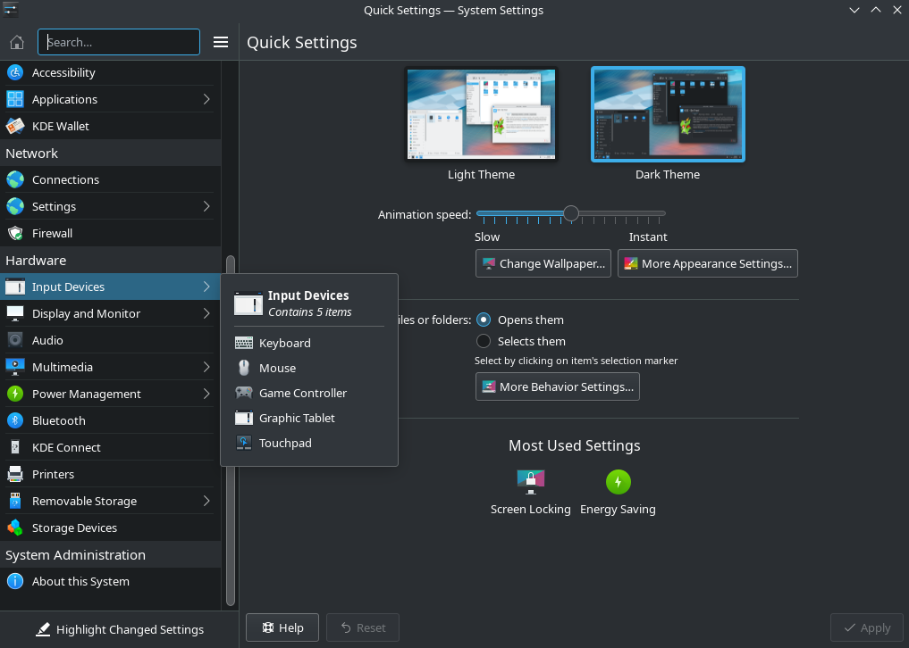  
   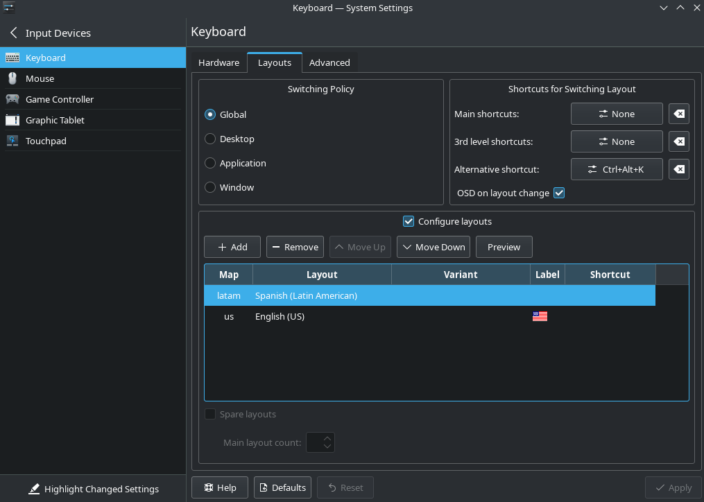

* Using VMware, create new virtual machines and install NetBSD

   # 1. Creación de Máquina Virtual
   
   Se creó una nueva máquina virtual utilizando **VMware** con los siguientes parámetros recomendados para una instalación óptima de NetBSD:
 
   - **Memoria RAM:** 4 GB  
   - **Espacio en Disco:** 32 GB  
   - **Procesadores:** 2 núcleos, 2 hilos  
   - **Adaptador de red:** Bridged (Automático)

   # 2. Instalación del Sistema Operativo
   ## 2a. Instalación sin Interfaz Gráfica

   1. Al iniciar el instalador, seleccionamos la opción:  
      **`a: Install NetBSD to hard disk`**
      
      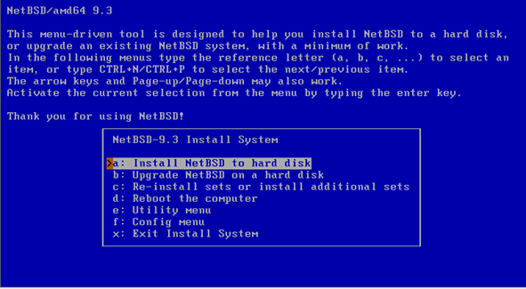

   2. Seguimos los siguientes pasos de instalación:
      - Seleccionar el disco de destino.
      - Elegir particionado **GPT**.
      - Confirmar la geometría del disco.
      - Establecer tamaños de particiones para NetBSD.
      - Confirmar las particiones generadas.

      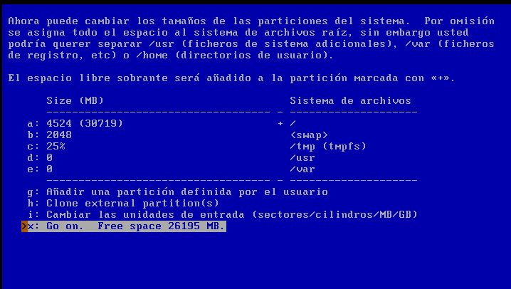
      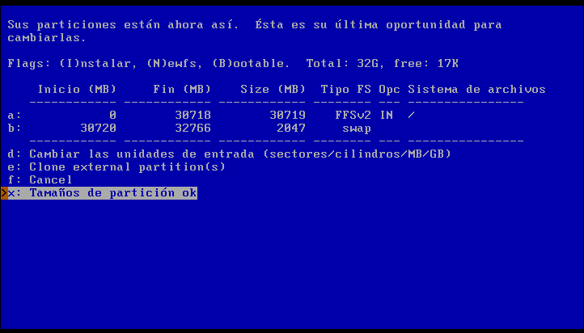

   3. Seleccionamos la opción de **consola BIOS** como método de bootloader:

      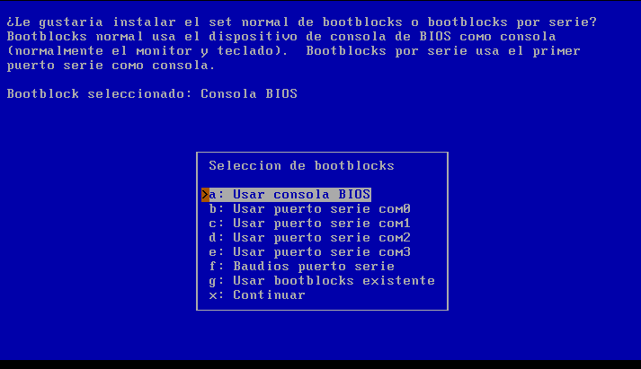

   4. Cuando pregunte el tipo de instalación, elegimos **instalación personalizada**:

      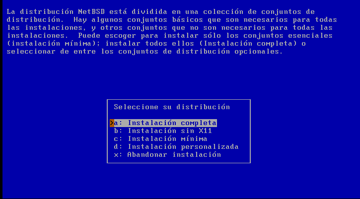

   5. Para una instalación **sin entorno gráfico**, seleccionamos los siguientes paquetes:
      - `Kernel (GENERIC)`
      - `Kernel Modules`
      - `Base`
      - `System (/etc)`

      Luego, continuamos con la instalación desde el medio de CD.

      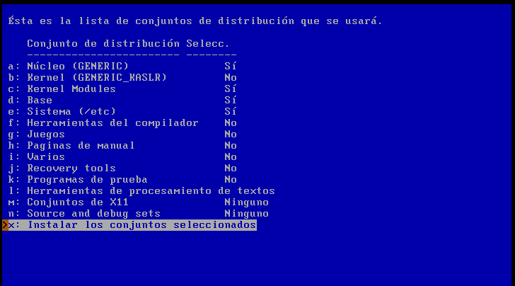

   6. Llegaremos al menú de configuración de utilidades:
      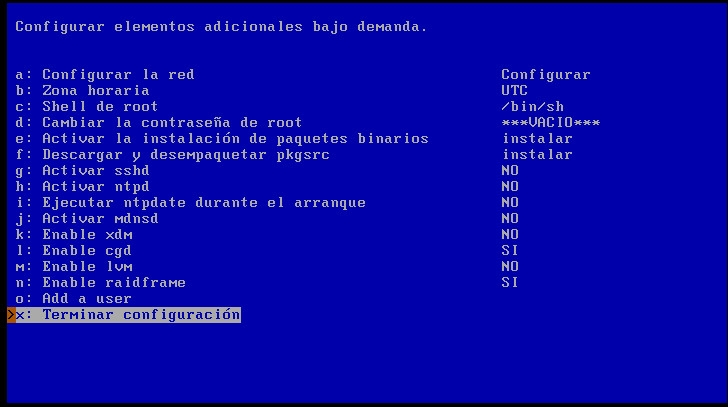

      Configuramos los parámetros de red de la siguiente forma:
      - **IP:** `10.2.77.251`
      - **Máscara de red:** `255.255.0.0`
      - **Gateway:** `10.2.65.1`
      - **Nameserver (DNS):** `8.8.8.8`
      - **Dominio:** `is.escuelaing.edu.co`
      - **Hostname:** (a preferencia del usuario)

      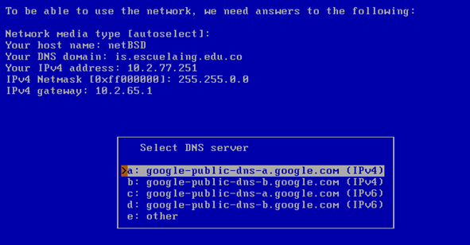

   7. Volviendo al menú, configuramos la **zona horaria**:
      - Seleccionamos: `America/Bogota`

   8. Configuración de la **Root Shell**:
      Al elegir la shell para el usuario root, tenemos tres opciones:
      - **sh:** Shell básica de Bourne. Tradicional, pero puede presentar problemas con la distribución de teclado latinoamericano.
      - **ksh:** Korn Shell, más moderna que `sh`, mejor soporte de scripting.
      - **csh:** C Shell, diferente sintaxis, útil para ciertos entornos UNIX.

      > Recomendación: usar `ksh` para evitar problemas de teclado.

   9. Asignamos una contraseña al usuario **root** (por ejemplo: `root1234`).

   10. **Habilitar instalación de paquetes binarios (`pkgin`):**
      
   - Durante la instalación, habilitamos la opción para **paquetes binarios**.
   - Instalamos `pkgin` para facilitar la gestión de paquetes.  
   Si presenta problemas usando HTTP, cambiar a FTP.

      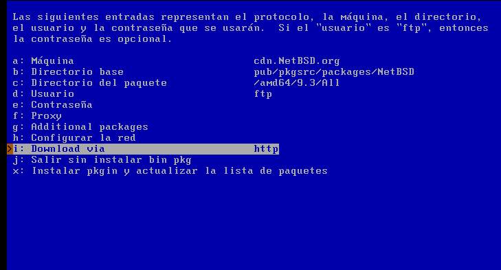

   11. Finalmente, verificamos el resumen de configuración del sistema y procedemos a **reiniciar**:
   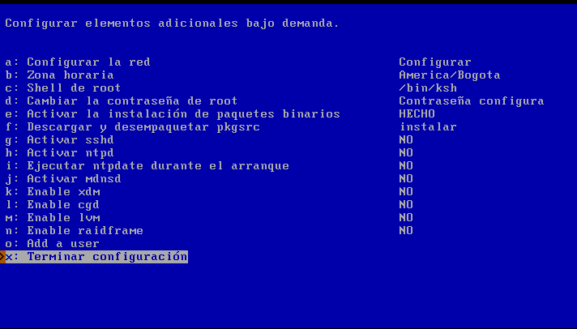

   ## 2b. Instalación con Interfaz Gráfica

   Para realizar una instalación con entorno gráfico:

   1. Seguimos los mismos pasos anteriores.
   2. En la selección de paquetes, además de los básicos, **añadimos todos los conjuntos de `X11`** (sistema gráfico de ventanas).

      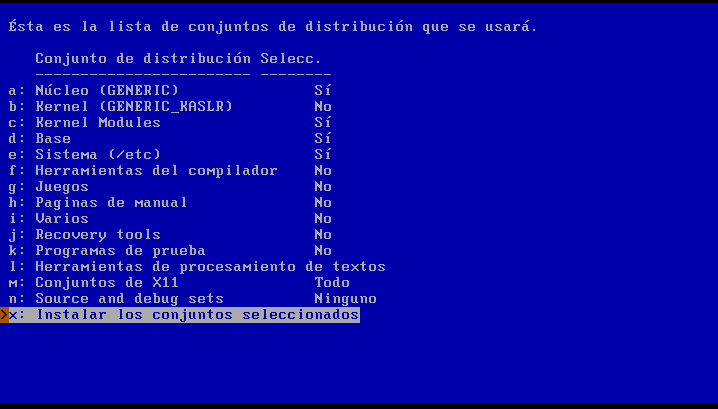

   3. En el menú de utilidades posterior a la instalación de paquetes, habilitamos el servicio de **`xdm`** (gestor de inicio gráfico).

      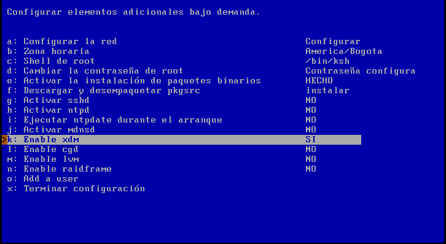

   Con esto, el sistema arrancará en modo gráfico automáticamente al iniciar.

   # 3. Configuración de la Red
   Si por alguna razón cometiste un error durante la configuración de red, puedes corregirlo fácilmente.
   ## Opción 1: Usar el menú de configuración de utilidades
   Puedes acceder nuevamente al menú de utilidades usando el siguiente comando:

   ```bash
   sysinst
   ```

   Desde este menú podrás:
   - Volver a **configurar la red** (IP, Gateway, DNS, etc.).
   - **Activar la instalación de paquetes binarios** (`pkgin`).
   - **Descargar y desempaquetar** el árbol de paquetes fuente (`pkgsrc`).
   - **Habilitar servicios** como `ntpd` (sincronización de hora).

   ## Opción 2: Configurar manualmente
   También puedes editar manualmente los archivos de configuración de red si prefieres un enfoque más directo:
   - `/etc/ifconfig.<interfaz>` → Configuración IP estática de la interfaz de red (por ejemplo, `ifconfig.wm0`).
   - `/etc/resolv.conf` → Configuración de los servidores DNS.
   - `/etc/rc.conf` → Activación de servicios como `dhcpcd`, `ntpd`, entre otros.
   - `/etc/hosts` → Configuraciones locales de nombres de host.

   # 4. Configuraciones Adicionales
   ## Configuración automática de red en NetBSD

   Dentro de este repositorio se creó el script `configNetNetBSD.sh`, el cual permite configurar automáticamente las direcciones IP dependiendo de si estás conectado a la red de la **Escuela de Ingeniería** o en una red **externa**.

   Este script facilita el cambio dinámico de configuración de red de forma automática al arrancar el sistema.

   ### Uso del Script `configNetNetBSD.sh`
   ### ¿Qué hace el script?

   - Detecta automáticamente si tienes conectividad hacia la puerta de enlace de la Universidad.
   - Configura la IP estática, máscara de red, gateway, dominio y servidores DNS correspondientes.
   - Configura el nombre del host (`hostname`).
   - Genera un log diario de la configuración realizada.
   - Integra el script de red al arranque del sistema modificando `rc.local` (si existe).

   ### ¿Cómo usarlo?

   1. **Da permisos de ejecución y ejecuta el instalador**:

      ```bash
      chmod +x configNetNetBSD.sh
      ./configNetNetBSD.sh
      ```

   2. **Durante la ejecución, el script te pedirá varios datos:**

      - Ruta para guardar los logs (por defecto `/var/log`).
      - Datos de red para la **Universidad** (IP, Gateway, Máscara, Dominio, DNS).
      - Datos de red para la **Red Externa** (IP, Gateway, Máscara, Dominio, DNS).
      - Nombre del hostname del equipo.
      - Nombre de la interfaz de red activa (por defecto `wm0`).

   3. **El script generará automáticamente un nuevo archivo:**

      ```bash
      /etc/configNet.sh
      ```

      Este es el archivo que se ejecutará automáticamente al arrancar el sistema para configurar la red.

   ### ¿Qué archivos se modifican o crean?

   - `/etc/configNet.sh` → Script que configura la red en cada arranque.
   - `/etc/resolv.conf` → Se sobrescribe para actualizar los servidores DNS.
   - `/var/log/logip-YYYYMMDD.log` → Log diario de la configuración aplicada (o en la ruta de logs que hayas definido).
   - `/etc/rc.local` → Se actualiza (si existe) para llamar a `configNet.sh` automáticamente al inicio del sistema.

   ### Ejemplo de flujo de configuración

   Cuando corras `./configNetNetBSD.sh`, verás algo como:

   ```bash
   == Instalador de Script de Red para NetBSD ==
   Ruta para guardar los logs [/var/log]: 
   --- Configuración para red de la Universidad ---
   IP estática (Universidad): 10.2.77.250
   Gateway (Universidad) [10.2.65.1]: 
   Máscara de red (Universidad) [255.255.0.0]: 
   Dominio (Universidad) [is.escuelaing.edu.co]: 
   --- DNS para Universidad ---
   ¿Cuántos servidores DNS querés configurar para la universidad? 2
   DNS #1 (Universidad): 10.2.65.1
   DNS #2 (Universidad): 8.8.8.8
   --- Configuración para red Externa ---
   IP estática (Externa): 192.168.0.10
   Gateway (Externa): 192.168.0.1
   Máscara de red (Externa) [255.255.255.0]: 
   Dominio (Externa) [localhost]: 
   --- DNS para Red Externa ---
   ¿Cuántos servidores DNS querés configurar para la red externa? 2
   DNS #1 (Externa): 8.8.8.8
   DNS #2 (Externa): 1.1.1.1
   Nombre de host (hostname) [NETBSD]: netbsdhost
   Nombre de la interfaz de red activa [wm0]: wm0
   ```

   ### Recomendaciones

   - **Debes ejecutar el script como `root`** o con permisos de superusuario para poder modificar los archivos de sistema.
   - Asegúrate de que tu interfaz de red esté correctamente identificada (por ejemplo: `wm0`, `re0`, `vioif0`, etc.).
   - Puedes editar manualmente el script generado (`/etc/configNet.sh`) si deseas personalizar aún más la configuración.
   - Si no tienes `/etc/rc.local`, considera integrar el script usando métodos alternativos como `rc.d` para iniciar procesos al arranque en NetBSD.

   ## ¿`pkgin` no funciona o descarga muy lento?

   A veces `pkgin` puede no funcionar correctamente debido a problemas en el `$PATH`, especialmente dependiendo de la **shell** que utilices (`sh`, `ksh`, `csh`, etc.).

   ### Solución: Corregir el `$PATH`

   Edita tu archivo de perfil:

   ```bash
   nano ~/.profile
   ```

   Agrega la siguiente línea al final del archivo:

   ```bash
   export PATH=/usr/pkg/bin:/usr/pkg/sbin:$PATH
   ```

   Guarda, cierra el archivo y abre una nueva terminal o ejecuta:

   ```bash
   source ~/.profile
   ```

   Ahora `pkgin` debería funcionar sin problemas.


   ### ¿`pkgin` descarga muy lento?

   Si las descargas con `pkgin` son muy lentas, probablemente esté usando `ftp` en lugar de `http`.

   #### Solución: Cambiar el repositorio

   Edita el archivo de repositorios:

   ```bash
   nano /usr/pkg/etc/pkgin/repositories.conf
   ```

   Cambia la URL para que use `http`, por ejemplo:

   ```plaintext
   http://cdn.NetBSD.org/pub/pkgsrc/packages/NetBSD/9.3/amd64/All
   ```

   Esto debería mejorar significativamente la velocidad de descarga.


   ### ¿`pkgin` falla con error de OSABI (versión del sistema operativo)?

   Puede que encuentres un error como este:

   > The Operating System version (9.3) does not match 9.0  
   > To force installation of this package, add CHECK_OSABI=no to pkg_install.conf

   Este error aparece cuando hay diferencia entre la versión del sistema y la versión esperada por los paquetes.

   #### Solución: Desactivar verificación estricta

   Edita o crea el archivo:

   ```bash
   nano /etc/pkg_install.conf
   ```

   Agrega la siguiente línea:

   ```bash
   CHECK_OSABI=no
   ```

   Esto permitirá instalar paquetes aunque haya diferencias menores de versión.


   ## ¿Deseas instalar un sistema gráfico más cómodo?

   Si durante la instalación no configuraste **X11** ni habilitaste **xdm**, o si quieres un entorno gráfico más moderno, puedes instalar el entorno de escritorio **MATE**.

   ---

   ### Instalación de MATE

   Primero, instala el entorno completo:

   ```bash
   pkgin install mate
   ```


   ### Instalación de un Display Manager (opcional pero recomendado)

   Para iniciar sesión gráfica de forma automática, puedes usar **SLiM**, un gestor de sesiones ligero:

   ```bash
   pkgin install slim
   ```

   Durante la instalación, te recordarán crear un script de inicio para SLiM.  
   Hazlo con los siguientes comandos:

   ```bash
   cp /usr/pkg/share/examples/rc.d/slim /etc/rc.d/
   chmod 755 /etc/rc.d/slim
   ```

   Luego edita el archivo `/etc/rc.conf`:

   ```bash
   nano /etc/rc.conf
   ```

   Agrega:

   ```bash
   slim=YES
   ```

   Y si antes habías habilitado `xdm`, desactívalo para evitar conflictos:

   ```bash
   xdm=NO
   ```


   ### Configurar SLiM para iniciar MATE automáticamente

   Crea o edita el archivo `~/.xsession`:

   ```bash
   nano ~/.xsession
   ```

   Escribe lo siguiente:

   ```bash
   #!/bin/sh
   exec mate-session
   ```

   Guarda el archivo, y asegúrate de que tenga permisos de ejecución:

   ```bash
   chmod +x ~/.xsession
   ```

   Ahora al iniciar sesión gráfica, se cargará automáticamente **MATE**.


   ## Configuración de la distribución del teclado en el sistema gráfico

   Una vez que tengas MATE instalado, es posible que el teclado esté en inglés. Para cambiarlo a español latinoamericano:

   1. Instala el paquete de configuraciones de teclado si es necesario:

   ```bash
   pkgin install setxkbmap
   ```

   2. Luego, en tu sesión de MATE, puedes ejecutar:

   ```bash
   setxkbmap -layout latam
   ```

   3. Si quieres que el cambio sea permanente, puedes agregar el comando anterior a tu `~/.xsession`


   ## Configuración del prompt en la terminal de NetBSD

   Si deseas personalizar el **prompt** (`PS1`) en NetBSD para que sea más informativo y visual, puedes configurar los archivos de perfil de tu **shell**.

   > **Nota:** Esta configuración aplica si estás utilizando **`ksh`** (KornShell).

   ### ¿Qué archivos debes editar?

   - `~/.profile`: Archivo de configuración para sesiones de login.
   - `~/.kshrc`: Archivo de configuración para sesiones de shell interactivas.

   ### Configuración paso a paso

   1. **Indicar que `ksh` cargue `~/.kshrc` automáticamente**

      Abre `~/.profile`:

      ```bash
      nano ~/.profile
      ```

      Y agrega al final la siguiente línea:

      ```bash
      export ENV="$HOME/.kshrc"
      ```

      Esto le dice a `ksh` que siempre cargue el archivo `~/.kshrc` al iniciar cualquier shell.

   2. **Personalizar el prompt**

      Crea o edita el archivo `~/.kshrc`:

      ```bash
      nano ~/.kshrc
      ```

      Y agrega el siguiente contenido:

      ```bash
      if [ "$(id -u)" -eq 0 ]; then
         PS1='$(whoami)@$(hostname):$PWD# '
      else
         PS1='$(whoami)@$(hostname):$PWD$ '
      fi
      ```

      Hacemos lo mismo para el archivo `~/.profile`

* What files are generated during installation in each virtualization software, and what are their purposes?
   Durante la instalación, **VMware** genera varios archivos clave:

   - `.vmx`: Archivo de configuración de la máquina virtual.
   - `.vmdk`: Disco duro virtual donde se instala el sistema operativo.
   - `.nvram`: Almacena el estado de la BIOS/UEFI de la VM.
   - `.log`: Archivos de registro de actividad de la VM.
   - `.vmxf` y `.vmsd`: Archivos adicionales de configuración y snapshots.

   Estos archivos permiten que la máquina virtual funcione correctamente y sea portable entre sistemas con VMware.

* Is it possible to convert a VMware virtual machine to VirtualBox and vice versa?

   Sí, es posible.  
   - Para convertir de **VMware a VirtualBox**, puedes usar herramientas como `VBoxManage` (incluida en VirtualBox) o software de terceros para convertir `.vmdk` a `.vdi`.  
   - Para convertir de **VirtualBox a VMware**, se puede usar `qemu-img` o el propio VMware Workstation, importando el disco `.vdi` y convirtiéndolo a `.vmdk`.

   Es importante tener en cuenta compatibilidad entre controladores y adaptadores de red en ambas plataformas.

* Create four users in each operating system and ensure the following:
   - Assign meaningful names, Provide each user with a meaningful description, Each user should have a home directory matching their username, located in the /usuarios directory at the root of the main file system.
   - What is the file system? Which one did you use during installation? What are its characteristics?
   - Create two groups: ”Accounting” and ”IT.”
   - The first two users should belong exclusively to the ”Accounting” group, while the other two should be part of the ”IT” group.


* What do ”Bridge Mode” and ”NAT Mode” mean? What IP address was assigned
to the machine?
   - Bridge Mode: Conecta directamente la máquina virtual a la red física, como si fuera otro equipo en la misma LAN. La máquina obtiene una IP del mismo rango que el host.
   - NAT Mode: La máquina virtual comparte la IP del host y utiliza NAT para salir a internet. La VM está en una red privada y no es visible desde fuera por defecto.

* Test the operating system’s network functionality by performing the following checks:
   - Check your computer’s IP address (host computer). Use the ipconfig command in Windows
   or ifconfig (or equivalent) in Linux.
   - Use the ping command to test connectivity:
      * ping 10.2.77.n (the machine being configured)
      * ping 10.2.65.1
      * ping 8.8.8.8
      * ping 10.2.77.m (another machine in your group or another group)
      * ping www.google.com


## Windows Server Installation and Configuration – Phase 1

* Create a new virtual machine using VMware and install Windows Server without a graphical interface.  
  **Note:** Do not configure Active Directory.

   ### 1. Creación de Máquina Virtual

   Se creó una nueva máquina virtual utilizando **VMware** con los siguientes parámetros recomendados para una instalación óptima de Windows Server:

   - **Versión de Windows:** Windows Server 2022 Datacenter Core  
   - **Memoria RAM:** 4 GB  
   - **Espacio en Disco:** 70 GB  
   - **Procesadores:** 4 núcleos, 2 hilos  
   - **Adaptador de red:** Bridged (Automático)

   ### 2. Instalación del Sistema Operativo

   Al iniciar la máquina virtual, se inicia automáticamente la instalación de la versión **Core** (sin interfaz gráfica) de Windows Server 2022.  
   Una vez finalizada la instalación, el sistema se reinicia y se presenta una consola básica para la configuración inicial.  
   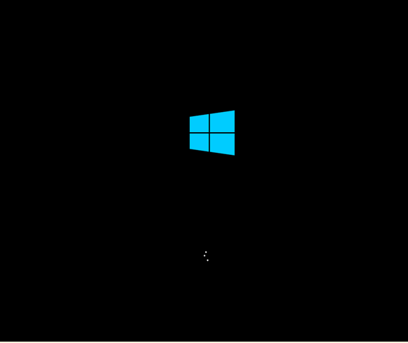  
   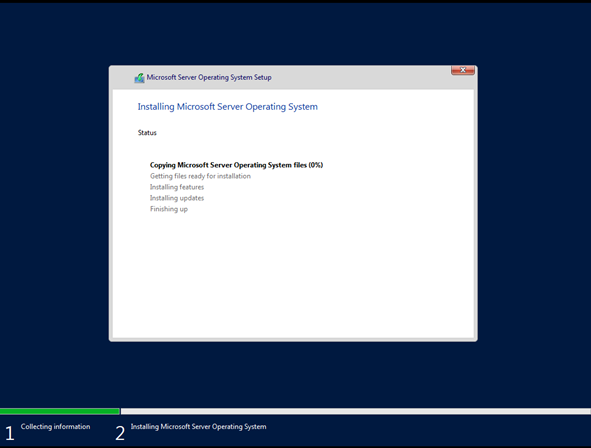

   ### 3. Configuración de Red

   En la consola, se utiliza la herramienta `sconfig` para realizar la configuración de red:

   1. Ejecutar `sconfig` desde la línea de comandos si no se inicia automáticamente.  
   2. Seleccionar la opción **8) Network Settings**.  
   3. Elegir el adaptador de red correspondiente.  
   4. Asignar manualmente los siguientes valores de red:

      - **Dirección IP:** `10.2.77.249`  
      - **Máscara de subred:** `255.255.0.0`  
      - **Puerta de enlace predeterminada:** `10.2.65.1`  
      - **DNS preferido:** `10.2.65.1`  

   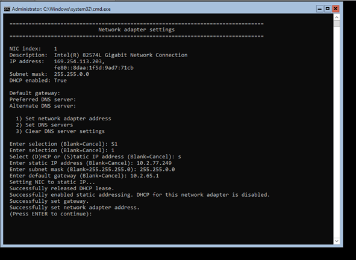  
   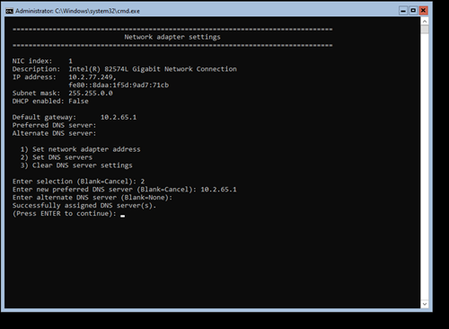

   ### 4. Configuraciones adicionales
   Se configuró la distribución de teclado utilizando PowerShell, fuera del entorno de `sconfig`. Para ello, se siguieron los siguientes pasos:

   1. Salir de `sconfig` seleccionando la opción **15) Exit to Command Line**.
   2. Ejecutar los siguientes comandos en **PowerShell**:

      - Consultar la distribución de teclado actual:  
      ```powershell
      Get-WinUserLanguageList
      ```

      - Crear una nueva lista de idiomas con la distribución de teclado de Latinoamérica (México):  
      ```powershell
      $LangList = New-WinUserLanguageList es-MX
      ```

      - Aplicar la nueva distribución forzadamente:  
      ```powershell
      Set-WinUserLanguageList $LangList -Force
      ```

      Esto cambia el idioma del sistema y la distribución del teclado a español (México), útil para adaptarse al layout latinoamericano estándar.  
      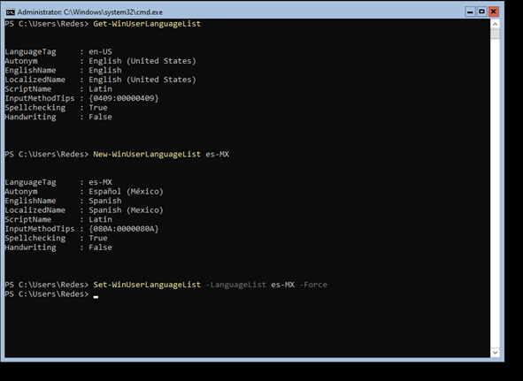

   3. Puedes consultar todas las distribuciones de teclado e idiomas soportados por Windows en la documentación oficial de Microsoft:  
      👉 [Language Identifier Constants and Strings – Microsoft Docs](https://learn.microsoft.com/en-us/windows-hardware/manufacture/desktop/default-input-locales-for-windows-language-packs)


* Test system functionality by executing the following commands:
   Una vez configurada la red, se verifica la conectividad ejecutando los siguientes comandos en la línea de comandos (CMD o PowerShell):

   - `ping <IP de la computadora anfitriona>` – Verifica conexión con el host.  
   - `ping 8.8.8.8` – Verifica acceso a internet mediante IP (Google DNS).  
   - `ping www.google.com` – Verifica resolución DNS y conexión externa.  

   


## Windows Server Installation and Configuration – Phase 2
* Install the graphical version of Windows Server using VMware.

   ### 1. Creación de Máquina Virtual

   Se creó una nueva máquina virtual utilizando **VMware** con los siguientes parámetros recomendados para una instalación óptima de Windows Server:

   - **Versión de Windows:** Windows Server 2022 Datacenter  
   - **Memoria RAM:** 4 GB  
   - **Espacio en Disco:** 70 GB  
   - **Procesadores:** 4 núcleos, 2 hilos
   - **Adaptador de red:** Bridged (Automatic)

   ### 2. Instalación del Sistema Operativo

   Al iniciar la máquina virtual, se comienza automáticamente con la instalación de la versión gráfica de Windows Server 2022.  
   Una vez completada, el sistema se reinicia y se procede con la configuración inicial.  
     
   

   ### 3. Configuración de Red

   1. Hacemos clic derecho sobre el ícono de red en la barra de tareas y seleccionamos **Abrir configuración de red e Internet**.
   2. Ingresamos a **Cambiar opciones del adaptador**, hacemos clic derecho sobre la interfaz activa y seleccionamos **Propiedades**.
   3. Dentro de las propiedades del **Protocolo de Internet versión 4 (TCP/IPv4)**, se asignan los siguientes valores:

      - **Dirección IP:** `10.2.77.247`  
      - **Máscara de subred:** `255.255.0.0`  
      - **Puerta de enlace predeterminada:** `10.2.65.1`  
      - **DNS preferido:** `10.2.65.1`  

      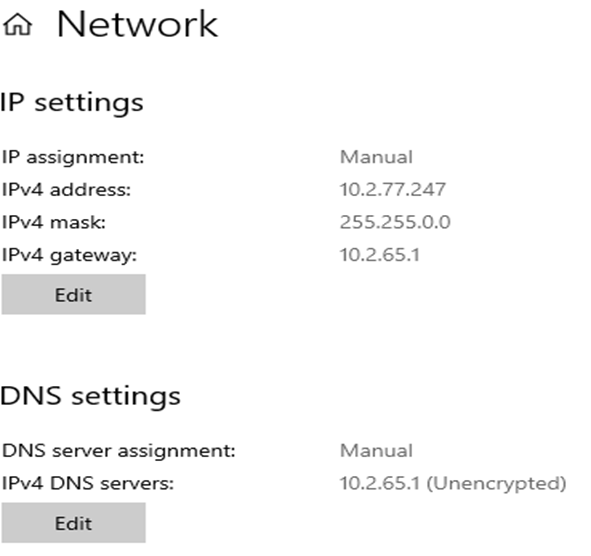

* Create four users.

   Para crear usuarios en Windows Server, se utiliza la herramienta **Administrador de equipos**:

   1. Ir al menú **Inicio** > Buscar **"lusrmgr.msc"** y abrirlo.
   2. En el panel izquierdo, seleccionar **Usuarios**.
   3. Clic derecho > **Nuevo usuario...**  
   4. Crear cuatro usuarios personalizados, por ejemplo:
      - Carlos1
      - Carlos2
      - Geronimo1
      - Geronimo2

   Cada usuario puede tener una contraseña única y configuraciones específicas de expiración o cambio obligatorio de contraseña.

* How are permissions managed in Windows Server?

   Windows Server gestiona los permisos mediante:
   - **Grupos de usuarios:** Se asignan permisos a grupos, y luego los usuarios se agregan a esos grupos.
   - **Permisos NTFS:** Para archivos y carpetas, usando propiedades > pestaña **Seguridad**.
   - **Políticas de grupo (GPOs):** Permite controlar permisos a nivel de sistema o dominio.

   Herramientas como **lusrmgr.msc**, **secpol.msc**, y **gpedit.msc** facilitan esta gestión.

* What is the directory structure of Windows Server?

   La estructura de directorios en Windows Server es similar a otras versiones de Windows, con carpetas clave como:

   - `C:\Windows` — Archivos del sistema operativo  
   - `C:\Users` — Perfiles de usuario  
   - `C:\Program Files` / `Program Files (x86)` — Aplicaciones instaladas  
   - `C:\inetpub` — Sitios web en servidores IIS  
   - `C:\Logs` o `C:\Windows\System32\LogFiles` — Archivos de registro  

* What is the Windows Registry? What is its purpose? How is it edited? What type of information does it store?

   El **Registro de Windows** (Windows Registry) es una base de datos jerárquica que almacena configuraciones y opciones del sistema operativo y de las aplicaciones.

   - **Propósito:** Gestionar configuraciones de hardware, software, usuarios y preferencias del sistema.
   - **Edición:** Se edita usando la herramienta `regedit.exe`.
   - **Tipo de información que almacena:**
   - Configuraciones del sistema
   - Preferencias de usuario
   - Información de hardware
   - Configuración de aplicaciones

   **Precaución:** Cambiar el registro incorrectamente puede causar errores graves.

* Assign different permission levels to the created users.

   1. Selecciona una carpeta o archivo, haz clic derecho y entra en **Propiedades** > pestaña **Seguridad**.
   2. Haz clic en **Editar** y luego en **Agregar** para incluir a los usuarios.
   3. Asigna diferentes niveles:
      - Geronimo1: Lectura
      - Carlos1: Modificación
      - Carlos2: Control total
      - Geronimo2: Denegado

* How are Windows Server logs accessed?

   Los registros se consultan con el **Visor de eventos**:

   1. Ir a **Inicio** > buscar “Visor de eventos” o `eventvwr.msc`.
   2. Se pueden revisar logs bajo diferentes categorías:
      - **Aplicación**
      - **Seguridad**
      - **Sistema**
      - **Setup**
      - **Forwarded Events**

* Identify server log events such as failed login attempts, user access, and unauthorized actions (e.g., attempting to delete a file without permission).

   Para asignar permisos a un usuario sobre archivos o carpetas, haz clic derecho sobre el elemento deseado, selecciona **Propiedades** > pestaña **Seguridad**, luego haz clic en **Editar** y ajusta los niveles de permiso según sea necesario.  
   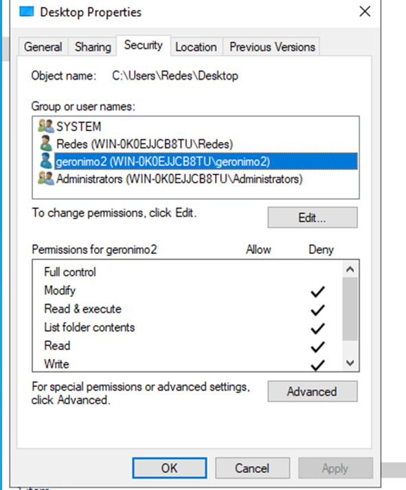

   Para auditar eventos de seguridad como intentos de inicio de sesión fallidos o accesos no autorizados, se utiliza el **Visor de eventos** de Windows Server:

   1. Abre el **Visor de eventos** (`eventvwr.msc`) desde el menú de inicio.
   2. Navega a **Registros de Windows** > **Seguridad**.
   3. Busca los siguientes códigos de evento:

      - **ID 4625:** Intento de inicio de sesión fallido.  
      - **ID 4624:** Inicio de sesión exitoso.  
      - **ID 4663:** Intento de acceso o modificación de un archivo/objeto.  
      - **ID 4656:** Se solicitó acceso a un objeto (permiso denegado o no autorizado).  

   Estos registros permiten identificar comportamientos sospechosos o accesos indebidos al sistema.  
   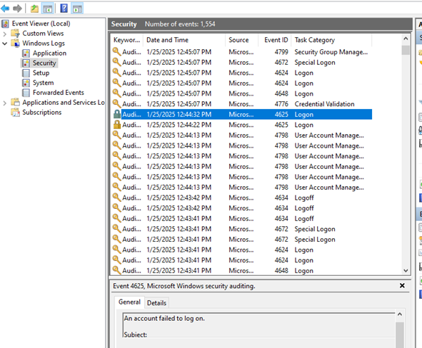


## Android Installation

* Create a new virtual machine using VMware and install Android.
   ### 1. Creación de Máquina Virtual

   Se creó una nueva máquina virtual utilizando **VMware** con los siguientes parámetros recomendados para una instalación óptima de Android:

   - **Memoria RAM:** 4 GB  
   - **Espacio en Disco:** 8 GB  
   - **Procesadores:** 4 núcleos, 2 hilos
   - **Adaptador de red:** Bridged (Automatic)

   ### 2. Instalación del Sistema Operativo

   1. Iniciamos la máquina virtual y seleccionamos la opción de **instalación personalizada**.  
      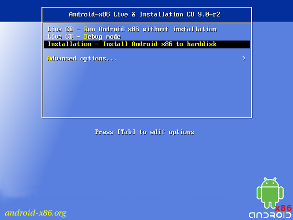

   2. Se creó una nueva partición sin utilizar GPT. Se seleccionó todo el espacio disponible y se configuró la partición como:
      - Tipo: **Linux**
      - Atributo: **Booteable**
      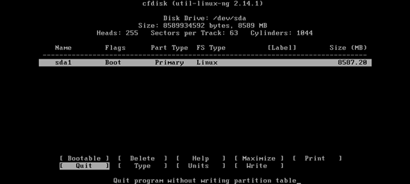

   3. Continuamos con la instalación:
      - Se formateó la partición con el sistema de archivos **ext4**.
      - Se instaló el gestor de arranque **GRUB**.
      - Finalizamos con un reinicio del sistema.  
      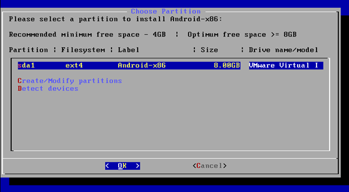

4. Tras el reinicio, seleccionamos la opción **Android (Debug nomodeset)**.  
   Una vez en consola, escribimos `exit` para continuar con el arranque.  
   Android se cargará y estará listo para su uso.  
   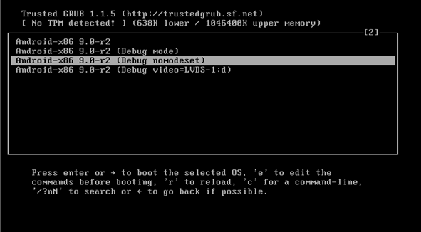  
   
* Configure network connectivity and test its operation as done with Linux.
   1. Para establecer conectividad a internet con una IP estática, se utilizó la red **wirtWifi**.  
   Se editó la conexión aplicando los siguientes parámetros:

      - **Dirección IP:** `10.2.77.248`  
      - **Máscara de Subred:** `255.255.0.0` o `/16`  
      - **Puerta de Enlace:** `10.2.65.1`  
      - **DNS:** `10.2.65.1`  
   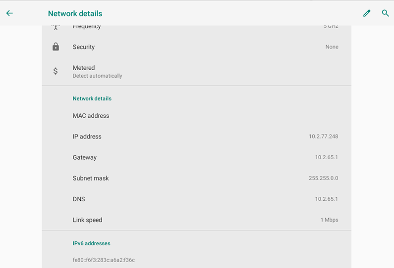

   2. Finalmente, se verificó la conexión utilizando la aplicación de consola integrada.  
   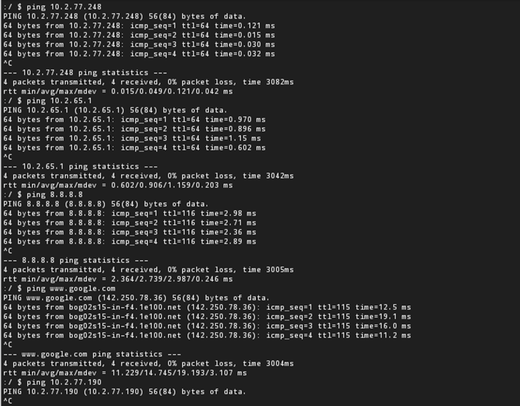


## Command Line Knowledge

- What is the shell?
    - El shell es un intérprete de comandos que permite a los usuarios interactuar con el sistema operativo mediante la línea de comandos. Puede ejecutar programas, administrar archivos y realizar tareas administrativas.
- Which shells are supported by Slackware, NetBSD, and Windows?
    - Slackware: Bash, sh, zsh, tcsh, ksh
    - NetBSD: sh, csh, ksh, zsh
    - Windows: CMD, PowerShell, WSL (Windows Subsystem for Linux con Bash, Zsh, etc.)
- What are their differences? Compare Unix-based shells separately from Windows shells.
    - Unix-based (Bash, Zsh, etc.): Usa scripts más potentes, soporte para redirección de salida (>), tuberías (|), variables de entorno avanzadas, y herramientas nativas como grep y awk.
    - Windows (CMD, PowerShell): CMD es más limitado que los shells de Unix, mientras que PowerShell ofrece un enfoque basado en objetos con comandos más estructurados (Get-Command, Select-Object).
- Identify, explain, and provide examples of commands in Linux, Unix, and Windows for the following tasks (Change directories, List directory structures and files, Copy or move a file, View file content without editing, Edit a file, View the first and last lines of a file, Search for a word in a file, Locate a file in the system)

| **Tarea**                              | **Comando en Unix/Linux**             | **Comando en Windows**              |
|----------------------------------------|---------------------------------------|-------------------------------------|
| Cambiar de directorio                  | `cd nombre_del_directorio`            | `cd nombre_del_directorio`          |
| Listar archivos y carpetas             | `ls` o `ls -l`                         | `dir`                               |
| Copiar o mover un archivo              | `cp origen destino` / `mv`            | `copy origen destino` / `move`      |
| Ver contenido sin editar               | `cat archivo` / `less` / `more`       | `type archivo` / `more archivo`     |
| Editar un archivo                      | `nano archivo` / `vim archivo`        | `notepad archivo`                   |
| Ver primeras y últimas líneas          | `head archivo` / `tail archivo`       | `more archivo` (limitado)           |
| Buscar una palabra en un archivo       | `grep 'palabra' archivo`              | `findstr "palabra" archivo`         |
| Localizar un archivo en el sistema     | `find / -name archivo`                | `where archivo` / `dir archivo /s`  |

# Usos y Aplicaciones

1. **Virtualización y Servidores Virtuales**
   - **Optimización de Recursos:** La virtualización permite ejecutar múltiples sistemas operativos en un solo servidor físico, reduciendo costos y consumo energético.
   - **Entornos de Pruebas y Desarrollo:** Facilita la creación de entornos aislados para pruebas de software sin afectar sistemas de producción.
   - **Recuperación ante Desastres:** Se pueden clonar máquinas virtuales y restaurarlas fácilmente en caso de fallos.

2. **Configuración de Servidores Unix y Windows**
   - **Implementación de Infraestructura Empresarial:** Servidores Linux y Windows se utilizan para gestionar redes, bases de datos, aplicaciones empresariales y servicios en la nube.
   - **Administración de Usuarios y Seguridad:** La configuración de permisos y grupos es clave para la gestión segura de información en empresas.
   - **Gestión de Redes y Servicios:** La configuración de IPs, NAT y Bridge Mode permite conectar servidores con redes físicas y virtuales.

3. **Contenedores vs. Máquinas Virtuales**
   - **Despliegue Ágil de Aplicaciones:** Los contenedores como Docker permiten ejecutar aplicaciones en diferentes entornos sin conflictos de configuración.
   - **Aislamiento de Procesos:** Se utilizan en entornos de microservicios, asegurando que cada servicio se ejecute de manera independiente.

4. **Instalación y Configuración de Windows Server**
   - **Infraestructura IT Corporativa:** Windows Server se usa en empresas para el manejo de directorios activos, bases de datos y servicios en la nube.
   - **Gestión Centralizada:** Permite administrar usuarios, permisos y políticas de seguridad desde una interfaz centralizada.

5. **Android en Máquina Virtual**
   - **Pruebas de Aplicaciones Móviles:** Ideal para desarrolladores que necesitan probar aplicaciones sin un dispositivo físico.
   - **Simulación de Entornos Android en PC:** Se usa para ejecutar apps móviles en un entorno de escritorio.

6. **Administración de Sistemas Operativos**
   - **Monitoreo y Seguridad:** La revisión de logs en Linux y Windows permite detectar intentos de intrusión o fallos en el sistema.
   - **Automatización de Tareas:** Se pueden programar scripts para administrar servidores sin intervención manual.
   - **Gestión de Almacenamiento:** La estructura de archivos y permisos garantiza un uso eficiente y seguro del almacenamiento.


# Conclusiones
A lo largo de este informe, se han abordado los aspectos fundamentales para la instalación y configuración de máquinas virtuales con distintos sistemas operativos. Se inició con la elección del software de virtualización adecuado (VMware), seguido de la instalación y configuración de servidores Unix y Windows en diferentes fases. Además, se exploraron las particularidades de la instalación de Android y la importancia del manejo de la línea de comandos en estos entornos.
*	La virtualización se ha demostrado como una herramienta clave en la administración de sistemas, permitiendo optimizar recursos, mejorar la flexibilidad y facilitar el despliegue de entornos de prueba y producción. La configuración adecuada de cada sistema operativo es crucial para garantizar su correcto funcionamiento y seguridad dentro del entorno virtualizado.
*	La implementación de máquinas virtuales no solo facilita la administración de múltiples sistemas en un solo equipo, sino que también representa una solución eficiente para la experimentación, el aprendizaje y la gestión de infraestructuras de TI modernas.
*	También nos dimos cuenta de dos problemas comunes para la correcta conexión a internet de las maquinas la primera fue no haber configurado correctamente la maquina con el bridged, la segunda es usar las direcciones suministradas para evitar estorbar a los demás grupos, que fue lo que presenciamos a lo largo del desarrollo del laboratorio, como algunos grupos usaron una dirección que no era de ellos y estorbaban a otro grupo y a ellos mismos.


